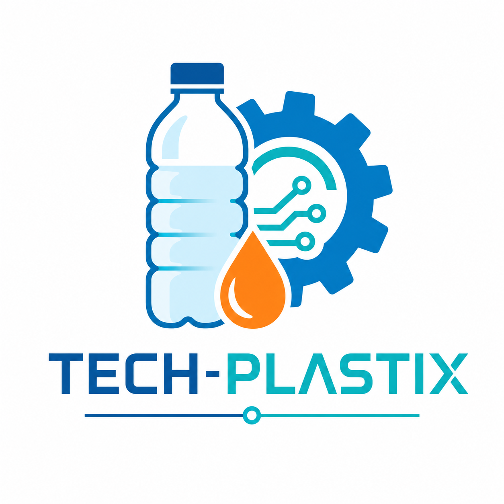

# 🧪 TECH-PLASTIX – Einstieg in das Thema Kunststoffe (Klasse 6, Technik)


---
<center></center>
---

## 🎯 Kurzbeschreibung

Diese Unterrichtseinheit ist ein **20-minütiger Einstieg** in das Thema **„Kunststoffe“** im Fach **Technik**, Klasse 6, Gemeinschaftsschule in Baden-Württemberg.  
Sie orientiert sich am **Bildungsplan 2016 Sekundarstufe I** für das Fach Technik, in dem u. a. grundlegende Werkstoffe, ihre Eigenschaften und Technikfolgen thematisiert werden.[web:4][web:11]  

Im Mittelpunkt steht ein **verständlicher Überblick**:

- Was ist Kunststoff?
- Wie entsteht Kunststoff grob „vom Erdöl zum Produkt“?
- Welche Chancen und Probleme bringt der Einsatz von Kunststoffen mit sich (nur kurz angerissen)?

---

## 🧩 Lernziele (Kompetenzen)

Die Schülerinnen und Schüler können …

- **K1 – Begriffsklärung:** in eigenen Worten erklären, was Kunststoff ist, und mindestens zwei Alltagsbeispiele benennen.
- **K2 – Prozesskette:** den groben Weg „Erdöl → Raffinerie → Kunststoffgranulat → Produkt“ in einer einfachen Skizze darstellen.[web:12][web:16][web:34]
- **K3 – Chancen/Probleme:** mindestens eine vorteilhafte und eine problematische Eigenschaft von Kunststoffen nennen (z. B. leicht & formbar vs. schlecht abbaubar).[web:16][web:34]

---

## 🧬 Was ist Kunststoff? (Schülergerechte Erklärung)

- **Kunststoff** ist ein **künstlich hergestellter Stoff**, der meistens aus **Erdöl** gemacht wird.[web:9][web:34]  
- Aus dem Erdöl gewinnt man kleine Bausteine, aus denen in der Chemie **lange Ketten (Polymere)** entstehen.[web:12][web:16]  
- Diese Kunststoffe kann man **leicht formen**, **einfärben** und für sehr viele Produkte nutzen, z. B. Flaschen, Tüten, Spielzeug, Gehäuse, Folien.[web:15][web:16]  

---

## 🛢️ Vom Erdöl zum Kunststoff – Übersicht

**Vereinfachte Prozesskette:**

```text
Erdöl (aus der Erde) 
      ⬇️
Raffinerie (Trennung in verschiedene Bestandteile)
      ⬇️
Chemische Reaktionen (Polymerisation → lange Ketten)
      ⬇️
Kunststoffgranulat (kleine Kügelchen)
      ⬇️
Formgebung (z. B. Spritzguss, Blasformen)
      ⬇️
Fertige Produkte (Flaschen, Folien, Gehäuse, Fasern)
```

- Erdöl wird in Raffinerien in verschiedene Bestandteile getrennt.[web:16][web:29]  
- Aus geeigneten Bestandteilen werden durch chemische Reaktionen große Moleküle (Polymere) aufgebaut – das sind die „Bausteine“ der Kunststoffe.[web:12][web:16]  
- Das Ergebnis ist oft **Kunststoffgranulat**, das eingeschmolzen und zu Produkten geformt wird.[web:16][web:27]  

---

## 🕒 Verlaufsplan für 20 Minuten (erster Stundenteil)

| Phase        | Zeit  | Sozialform | Ziel                                   | Inhalt / Methode |
|-------------|-------|------------|----------------------------------------|------------------|
| Einstieg    | 3–4'  | Plenum     | Interesse wecken, Vorwissen aktivieren | „Kunststoff-Kiste“ mit Alltagsgegenständen, Rätsel: „Was haben alle gemeinsam?“ |
| Begriffsfindung | 4–5' | Think-Pair-Share + Plenum | Alltagsdefinition entwickeln | Partnergespräch „Was ist Kunststoff?“, Sammeln an der Tafel, Lehrkraft ergänzt eine einfache, fachlich richtige Definition. |
| Input „Vom Erdöl zum Kunststoff“ | 7–8' | Plenum | Prozesskette verstehen | Kurzvortrag der Lehrkraft mit Skizzen (Erdöl → Raffinerie → Granulat → Produkt), SuS zeichnen Prozesskette vereinfacht ins Heft. |
| Sicherung   | 4–5'  | Einzel + Plenum | Kerngedanken sichern | Heftaufgabe: 2 Sätze zu „Was ist Kunststoff?“ + kleine Prozessskizze; 1–2 SuS stellen vor. |

---

## 🎓 Differenzierung

- **Unterstützung:**  
  - Satzanfänge an der Tafel (z. B. „Kunststoff ist …“, „Er wird hergestellt aus …“).  
  - Vorgezeichnete Prozesskette zum Ergänzen (Lückenschema).  

- **Forderung:**  
  - Zusatzfrage: „Warum kann es ein Problem sein, dass Kunststoffe so lange haltbar sind?“  
  - Transfer: SuS nennen erste Ideen, wie man Kunststoffe im Alltag einsparen kann.  

---

## 📚 Materialien

**Für die Lehrkraft:**

- Kiste mit typischen Kunststoff-Gegenständen (Flasche, Brotdose, Spielzeug, Verpackung etc.)  
- Tafel/Whiteboard oder digitale Tafel  
- ggf. 1–2 Folien/Slides mit der Prozesskette „Erdöl → Kunststoff“  

**Für die SuS:**

- Heft oder Arbeitsblatt  
- Stifte (für Skizze und Stichworte)

---

## 📺 Kurze Erklärvideos (empfohlen)

Diese Videos eignen sich als **kurze Impulse** oder für die Vertiefung (z. B. Hausaufgabe, zweiter Stundenteil). Bitte jeweils auf Altersangemessenheit und Werbeeinblendungen achten.

1. **Checker Tobi – Der Plastik-Check (Reportage für Kinder)**  
   👉 [https://www.youtube.com/watch?v=lF9RFcKiSCs](https://www.youtube.com/watch?v=lF9RFcKiSCs)  
   (Wie entsteht Plastik? Welche Probleme macht es in der Umwelt? kindgerecht erklärt)[web:27]  

2. **ZDF goes Schule – „Alles aus Plastik?!“**  
   👉 [https://schule.zdf.de/video/geschichte-plastik-einfach-erklaert-100](https://schule.zdf.de/video/geschichte-plastik-einfach-erklaert-100)  
   (Sehr kurzer Überblick über Geschichte, Vorteile und Probleme von Plastik)[web:33]  

3. **WDR Planet Wissen – „Was ist Plastik?“**  
   👉 [https://www1.wdr.de/mediathek/video/sendungen/planet-wissen-swr/video-was-ist-plastik-100.html](https://www1.wdr.de/mediathek/video/sendungen/planet-wissen-swr/video-was-ist-plastik-100.html)  
   (Grundlagen zu Kunststoffen und ihren Eigenschaften, mit Alltagsbeispielen)[web:16]  

4. **„Petrochemie: Wie aus Rohöl Kunststoff hergestellt wird“ (YouTube)**  
   👉 [https://www.youtube.com/watch?v=S8YluOEIoXM](https://www.youtube.com/watch?v=S8YluOEIoXM)  
   (Kurzer Einblick in die Umwandlung von Rohöl zu Kunststoffen – für stärkere SuS oder als Lehrkraft-Input)[web:35]  

5. **„Is Plastic Fantastic? – Die Wahrheit über Kunststoff“ (FHWS-Projektvideo)**  
   👉 [https://www.youtube.com/watch?v=nnRyxhwQQv0](https://www.youtube.com/watch?v=nnRyxhwQQv0)  
   (zeigt Chancen und Risiken des Kunststoffgebrauchs in moderner Gestaltung)[web:37]  

---

## 🌱 Ausblick auf weitere Stunden

Folgende Themen können in den nächsten Stunden vertieft werden:

- **Eigenschaften von Kunststoffen** (Dichte, Festigkeit, Verformbarkeit, Temperaturverhalten)  
- **Kunststoffe und Umwelt** (Plastikmüll, Mikroplastik, Recycling)[web:10][web:28][web:34]  
- **Werkstoffvergleich** (Kunststoff vs. Holz vs. Metall für ein konkretes Produkt)  

---

## 👨‍🏫 Autor und Lizenz

- **Autor/in:** Daniel Lienhard
- **Schulart:** Gemeinschaftsschule Baden-Württemberg  
- **Lizenz:** MIT

---
